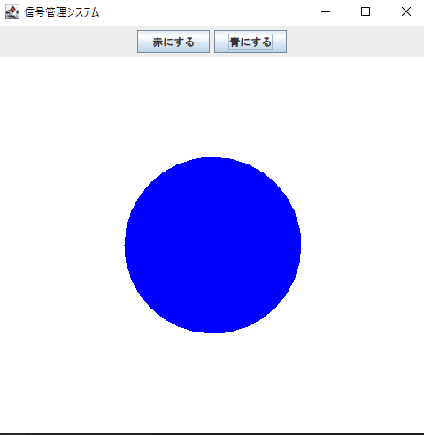
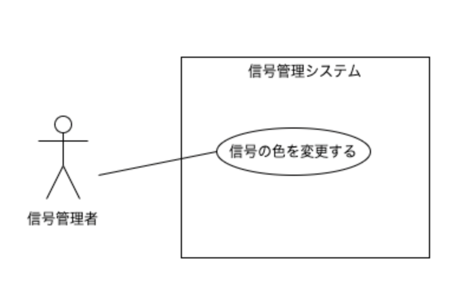
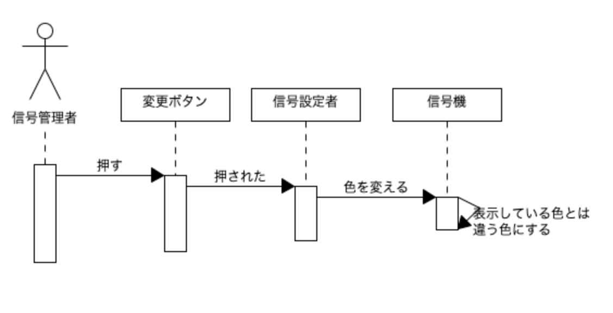
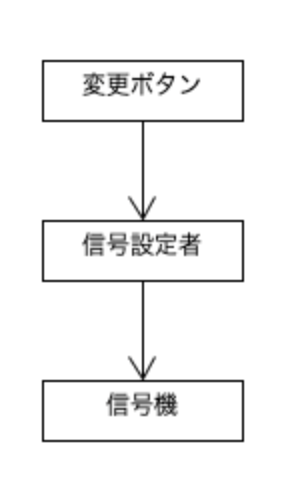

# 赤と青の信号機

## 1. コードの不足分を補い，コンパイルして実行せよ
- ボタンによって信号機の色が変わることを確認せよ
- 信号が赤の時，青の時のウィンドウをレポートに添付せよ

 

## 2. 信号管理システムを以下のように変更したい
- ボタンを「変更する」の1個にする
- ボタンを押すと，赤なら青へ，青なら赤へ，信号が変わる
- この時，以下の図をレポートに添付せよ
  - ユースケース図
  - ユースケース記述
  - 初期シーケンス図
  - 初期クラス図

  

  ユースケース図

    

  |||
  |:----|---|
  |**名称**        |信号の色を変更する|
  |**能動アクター**|信号管理者|
  |**受動アクター**|無し|
  |**メインフロー**： 1. 信号管理者は「変更するボタンを押す」 2.「変更する」が押されたことが信号設定者に通知される 3. 信号設定者は信号機に対して色を変えるよう指示 4. システム上に表示された信号機の色が変わる|
  |**例外フロー**：例外は発生しない|

ユースケース記述

  

  初期シーケンス図
    

  

  クラス図

